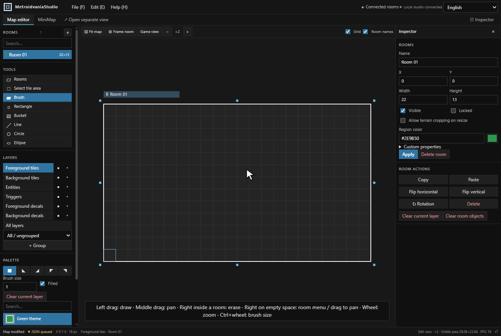
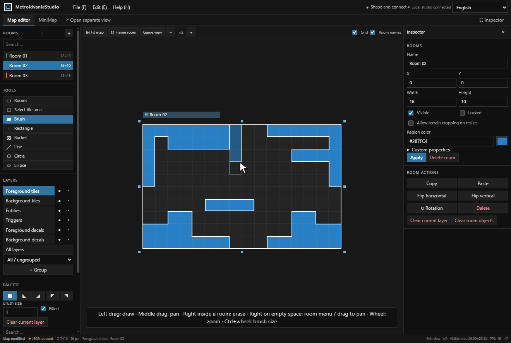
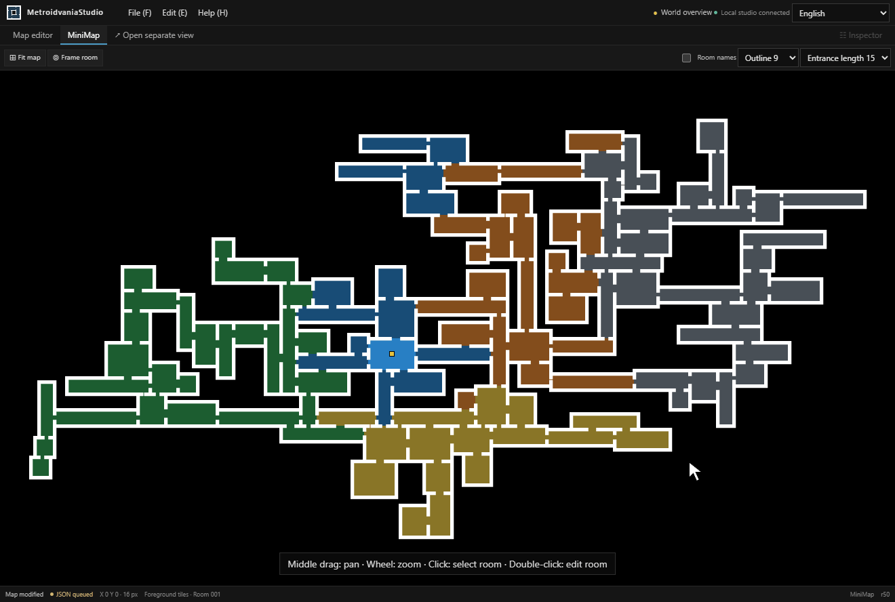

#  Metroidvania Studio

A web-based 2D world editor for metroidvania games. Create connected rooms, paint tilemaps, and design minimaps with JSON export for cross-engine workflows.

**Automate your workflow:** [Lua scripts](docs/scripting/quick-start.md), a [headless CLI](docs/cli/quick-start.md), and a [local MCP server for AI agents](docs/mcp/setup.md).

## Add Rooms & Paint Tiles



## Resize, Rotate & Connect Rooms



## Design Your Minimap



## Get Started

Runs locally on Windows, macOS, and Linux. No game engine installation is required.

Download a ready-to-run package from [GitHub Releases](https://github.com/LBarimi/metroidvania-studio/releases/latest), extract it, and open the launch file at the top level. The prebuilt web package requires **ASP.NET Core Runtime 10**.

To build from source, install:

| Requirement | Used for |
| --- | --- |
| **Node.js 24+** | Building the web UI and running build scripts |
| **.NET SDK 10** | Building the local server and command-line tools |
| **Git** | Validating source files during the build |

Then use the scripts for your platform:

| Platform | Build | Run |
| --- | --- | --- |
| Windows | `platform/win/web/build.bat` | `platform/win/web/run.bat` |
| macOS | `platform/mac/build.command` | `platform/mac/run.command` |
| Linux | `bash platform/linux/build.sh` | `bash platform/linux/run.sh` |

**Run** checks your local build against the current version and source files. It builds automatically when needed, then opens the studio in your browser. An up-to-date build starts immediately.

`Maps` and `Textures` are stored beside the launcher or at the source project root. Find them through **File → Storage folders**. Room JSON updates automatically in `Maps/AutoExport`; palette settings are managed in `.studio/catalog.json`. Keep `Maps`, `Textures` and `.studio` when updating the studio.

## Try the Sample World

A new workspace opens a six-room world with a looping route, a vertical shaft, a side chamber, slopes, background tiles, and object markers. You can also open it through **Help → Open sample world**.

Paint a room, **Ctrl-click** two rooms to move them together, or switch to the minimap and **double-click** a room to jump back into editing. See the [five-minute walkthrough](docs/sample-world.md) or [sample JSON](samples/maps/starter-world.map.json).

## Editing Basics

- **Paint:** left-drag inside the active room. The first click on another room selects it.
- **Erase:** right-drag inside the active room.
- **Pan and zoom:** middle-drag to pan, mouse wheel to zoom, **Ctrl + wheel** to change brush size. Right-drag on empty space also pans.
- **Arrange rooms:** right-click empty space to add a room, drag a room's title strip to move it, or drag its outer handles to resize. Rotation is available in the inspector.
- **Save and exchange maps:** use **File** for saving and JSON import/export. Use **Edit** for Undo/Redo. Set PPU and resolution beside **Game view** (defaults: **16** and **320×180**).

See **Help → Shortcuts** for the full control list. The interface follows your browser language and can be changed from the language picker.

Open **Help → Documentation** for searchable guides and the API reference, including offline access.

## Engine Packages

| Engine | Package | Installation |
| --- | --- | --- |
| Unity | [.unitypackage](engine-packages/unity/metroidvania-studio.unitypackage) | [Guide](engine-packages/unity/INSTALL_EN.txt) |
| Godot | [Addon ZIP](engine-packages/godot/metroidvania-studio.zip) | [Guide](engine-packages/godot/INSTALL_EN.txt) |
| Unreal Engine 4 | [Plugin ZIP](engine-packages/ue4/metroidvania-studio.zip) | [Guide](engine-packages/ue4/INSTALL_EN.txt) |
| Unreal Engine 5 | [Plugin ZIP](engine-packages/ue5/metroidvania-studio.zip) | [Guide](engine-packages/ue5/INSTALL_EN.txt) |
| SDL3 | [C++ source ZIP](engine-packages/sdl/metroidvania-studio.zip) | [Guide](engine-packages/sdl/INSTALL_EN.txt) |

Each engine folder includes translated installation guides. Maps use a shared [JSON format](metroidvania-studio/contracts/FORMAT.md); engine packages handle importing and rendering, while gameplay stays in your game project.

## Scripts & Automation

Use **File → Scripts** to generate rooms or repeat editing tasks. Run the same operations headlessly through the **CLI**, or connect an **AI agent** through the local **MCP server**. Dry runs, atomic updates, and revision checks keep scripted edits reviewable.

Install the CLI and MCP tools with **Node.js 24+** and the **.NET 10 runtime**:

```sh
npm install --global metroidvania-studio
```

Using a program download? Run `metroidvania-studio-cli.cmd help` on Windows, or `bash metroidvania-studio-cli.sh help` on macOS/Linux. See [headless from a download](docs/cli/release-downloads.md).

Start with the [automation guides](docs/index.md), [API reference](docs/api/index.md), [Lua examples](docs/examples/connected-rooms.lua), or [MCP setup](docs/mcp/setup.md).

## License

Project-owned code and assets use the [MIT License](LICENSE).
See [Third-party notices](THIRD-PARTY-NOTICES.md) for external components and their terms.
