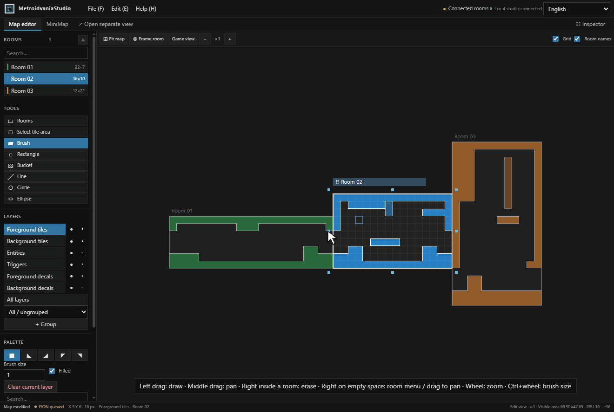
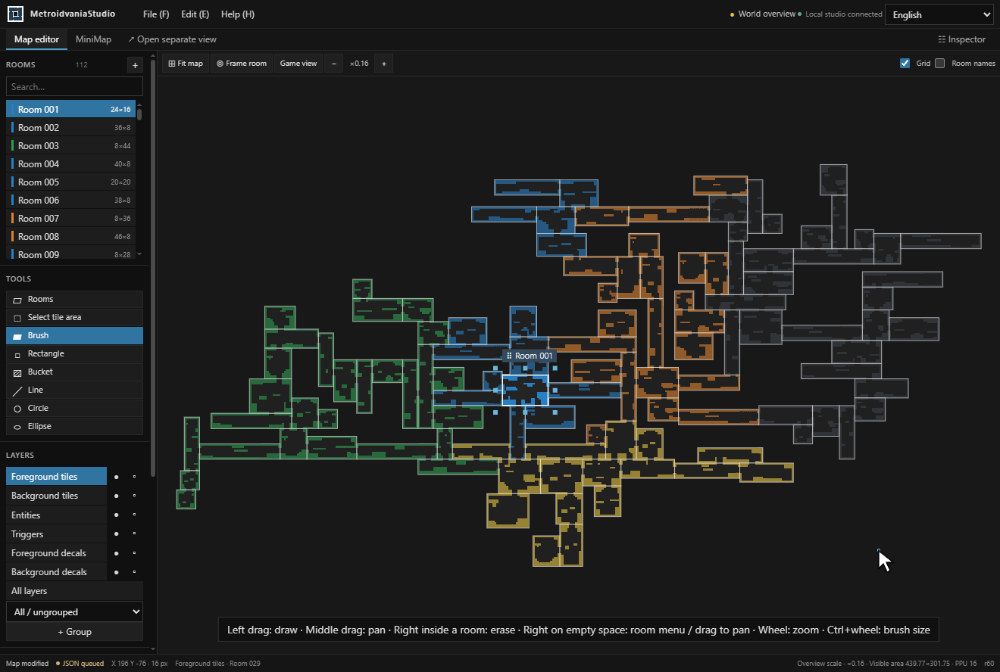

# MetroidvaniaStudio


**Create and paint.** Add a room, lay down terrain, and draw platforms with the tile tools.



**Shape the layout.** Resize rooms directly on the canvas while attached rooms move with the resized edge.


**See the connections.** Double-click a room in the minimap to open it in the map editor, then scroll to zoom out and explore the surrounding world.



**Work across a whole world.** Navigate 112 rooms with varied chambers, long corridors, vertical passages, and connected loops, then zoom in to edit.

A web-based 2D world editor for metroidvania games. Create connected rooms, paint tilemaps, and design minimaps with JSON export for cross-engine workflows.

The browser UI and local server run independently. Workspaces contain maps, resource definitions and textures; the Unity adapter in `engine-packages/unity` imports exported JSON and follows a local studio session. Other consumers can implement the same JSON contract.

## Platform launchers

The root `platform` folder contains native launch entry points:

| Platform | Build | Run | Stop |
| --- | --- | --- | --- |
| Windows | `platform/win/web/build.bat` | `platform/win/web/run.bat` | `platform/win/web/stop.bat` |
| Linux | `platform/linux/build.sh` | `platform/linux/run.sh` | `platform/linux/stop.sh` |
| macOS | `platform/mac/build.command` | `platform/mac/run.command` | `platform/mac/stop.command` |

Windows batch files and macOS command files can be opened from the file manager. Linux scripts can be run from a terminal. Run starts the local server in the background and opens the browser. `--no-browser` suppresses browser launch on Linux/macOS; Windows accepts `-NoBrowser`.

Build requires **Node.js 24+**, **.NET SDK 10**, and Git in a source checkout. After a successful build, Run requires only **ASP.NET Core Runtime 10**; Node.js and an SDK are not needed to run a complete build. Each platform uses its native runtime executable. Engine installations are not required. macOS requires a supported .NET 10 operating system version and the appropriate Intel or Apple Silicon runtime.

```sh
bash platform/linux/build.sh
bash platform/linux/run.sh --project ../Workspace --port 18765
bash platform/linux/stop.sh --project ../Workspace --port 18765
```

The matching macOS files use the same options. Paths with spaces must be quoted. Run resolves paths from its script location while relative workspace arguments are relative to the caller's working directory. Builds stay in `builds/`; authored data stays in the selected workspace.

Start/stop operations are serialized per launcher port. A startup token, process identity and server instance prevent accidental adoption or shutdown of another application. Only one server can write to a workspace at a time. Restart saves recovery and room exports before stopping; failed saves leave the server running. Missing or incomplete new builds never stop an existing working server.

Build, storage, and launcher validation scripts are included in the source tree. Local builds do not publish releases; release preparation requires the main branch.

## Windows shortcuts

For a source checkout, install Node.js 24 or later and .NET SDK 10. Use the batch files in `platform/win/web`:

- **platform/win/web/build.bat** builds the web editor and server into `builds/<version>-<build-id>/` without opening a browser. Each successful build updates `builds/latest.json`.
- **platform/win/web/run.bat** opens the last successful build in your browser without recompiling. If no local build exists, it builds once before the first launch.

Running an existing build only requires ASP.NET Core Runtime 10. Reopening the same build reuses its server. After building a newer version, Run saves and stops the previous session before starting the new version. Maps remain in `.local/workspace`, separate from generated builds. Failed builds leave the previous build available. `builds/` is excluded from Git; these local builds do not create releases or tags.

Pass `-NoBrowser` to the Windows Run script for background checks, and `-Project` / `-Port` for a custom workspace. To apply source changes, run Build again.

For a prebuilt Windows release, extract the complete archive, install ASP.NET Core Runtime 10, then double-click `platform/win/web/run.bat`. A prebuilt release does not require Node.js or an SDK. Release archives are framework-dependent and do not bundle a runtime.

The default workspace is `.local/workspace` under the studio folder. Keep this folder when updating an extracted release, or choose a separate workspace:

```powershell
.\platform\win\web\run.bat -Project ..\MyWorkspace
```

The default address is `http://127.0.0.1:18765/`; the minimap view is `http://127.0.0.1:18765/?view=minimap`. Use `-Port` to run another workspace on a different port.

```powershell
# Verify development tools without starting a server or opening a browser.
.\platform\win\web\build.bat -CheckOnly

# Rebuild and restart, first persisting the current session.
.\platform\win\web\build.bat
.\platform\win\web\run.bat -Restart

# Save pending edits and shut down the matching session.
.\platform\win\web\stop.bat
```

Pass the same `-Project` and `-Port` when restarting or stopping a custom workspace. The stop script verifies the recorded process and session before requesting shutdown. A failed save leaves the server running.

## Workspace and export

- `Maps/`: saved authoring documents.
- `Maps/AutoExport/`: derived JSON snapshots of rooms after editing becomes idle.
- `Maps/.Recovery/`: recovery data for an unfinished editing session.
- `.studio/catalog.json`: optional resource catalogue for this workspace.
- `Textures/`: workspace texture files referenced by the catalogue.

Project-owned examples are in `samples/`. They provide default resources without importing another project's data. Workspace paths are independent of the application source tree. JSON keeps room positions, layers, tile materials, objects and metadata; rendering and game behavior belong to the consuming application.

## Editing workflow

- **File (Alt+F)** creates or opens maps, adds rooms, imports room JSON files, and saves selected, all or changed rooms. Room import keeps the current map and can replace matching room IDs after confirmation. Changed-room export compares the destination files and leaves matching JSON untouched. **Ctrl+S** saves the complete authoring map.
- **Edit (Alt+E)** contains Undo/Redo, camera settings and map settings. **Help (Alt+H)** contains shortcuts and About, including the application symbol and build version.
- Drag the active room's title strip to move it while drawing. Room edges join only when the proposed destination overlaps another room; existing gaps stay as drawn. Outside handles resize rooms with any tile drawing tool.
- **Select tile area (V)** previews the selection while dragging. Drag inside to move it, or hold Shift to start a new selection. Copy, paste, reflect, rotate and delete act on selected contents; with a room selected, the inspector actions affect the whole room. Every modifying action supports Undo.
- Tile layers show tile drawing tools. Object layers show placement and object selection. Choose an object in the palette, then click or drag to place it.
- The language picker supports Korean, English, Japanese, Simplified Chinese, Traditional Chinese (Taiwan) and Russian. It follows the browser language initially and remembers explicit choices.

## Camera settings and engine packages

The ready-to-import Unity package is included at [`engine-packages/unity/metroidvania-studio.unitypackage`](engine-packages/unity/metroidvania-studio.unitypackage). See the [installation and JSON import guide](integrations/unity/README.md).

Use **Edit > Camera settings** to configure PPU (default 16) and reference resolution (default 320×180). Settings belong to the current map, support Undo/Redo, and survive save, import and per-room JSON export. Source tiles remain 16×16; PPU changes world-unit conversion, while resolution changes the visible game area.

The Unity adapter targets 6000.3.9f1. Platform builds also create `engine-packages/unity/metroidvania-studio.unitypackage`. Import it into Unity, open **Tools > MetroidvaniaStudio**, connect to the running local studio and load a room. See `integrations/unity/README.md` for installation, live refresh, offline imports and runtime APIs. Engine assemblies are never referenced by the web studio or server.

## Development

```powershell
node tools/repository/check-text.mjs
node metroidvania-studio/build-web.mjs --check-contracts
node metroidvania-studio/build-web.mjs
dotnet run --project metroidvania-studio/core-tests/MetroidvaniaStudio.Core.Tests.csproj
dotnet run --project metroidvania-studio/server-tests/MetroidvaniaStudio.Server.Tests.csproj
node --test tools/repository/content-text.test.mjs tools/repository/check-text.test.mjs tools/repository/check-boundaries.test.mjs tools/release/release.test.mjs
```

Browser interaction tests use disposable workspaces and a headless browser. Install Playwright separately and pass its module path if it is not available in local module resolution:

```powershell
.\metroidvania-studio/tests\Run-Browser-Interaction.ps1 -PlaywrightModule ..\browser-tools\node_modules\playwright
```

All test fixtures, local logs and generated builds stay outside tracked source. Core and server builds use .NET 10 with no additional NuGet packages; web output uses local modules. Developer tool paths can be provided through `METROIDVANIA_STUDIO_NODE`, `METROIDVANIA_STUDIO_DOTNET`, or `DOTNET_ROOT`. Successful local builds remember the selected executables in `.local/toolchain.json` so desktop launches can find them without changing the system PATH. This file is excluded from Git, is not packaged, and each executable is checked again before use.

## Version and release

`version.json` is the authoritative application version, initially `0.1.0`. The JSON document format remains version 2; its schema and conventions are in `metroidvania-studio/contracts/`. Update it and the matching entry in `CHANGELOG.md` before a release. Commit reviewed changes to `main` first; release preparation rejects feature branches, pending files, stale main revisions and existing version tags.

```powershell
# Read-only release policy check; main is required.
node tools/release/release.mjs --dry-run

# Validate and create a local Windows archive; creates no tag and uploads nothing.
node tools/release/release.mjs --pack
```

Automation configuration is local and excluded from Git. Releases must still come from `main` with a matching version tag. Local packaging creates no tag and publishes nothing. The archive includes the local server, launcher, web UI, localization, sample resources, platform scripts and engine installer; private workspace data is excluded.

License selection is pending.

Windows web entry points live under `platform/win/web/`; other Windows application formats can use separate sibling folders.

## Directory naming

Project-owned directories use lowercase kebab-case, including `metroidvania-studio/`, `samples/`, `tools/`, and `builds/`. Unity-reserved `Assets` and `Editor` folders retain their required spelling. Filenames, public types, JSON resource identifiers and existing workspace data paths remain compatible. Generated SDK caches follow their tool conventions. Test screenshots and diagnostics are private under `.local/logs/`; they are not needed to run the studio.

The Unity installer has one stable filename: `engine-packages/unity/metroidvania-studio.unitypackage`. Platform builds regenerate it and include the same file in their output. Version numbers remain in release metadata and tags.

Engine installers are published under `engine-packages/<engine>/`. Adapter source, build scripts, documentation and validation live under `integrations/<engine>/`; `engine-packages/unity/` contains only `metroidvania-studio.unitypackage`.


## Engine packages

Distributable installers live under `engine-packages`: Unity `.unitypackage`, Godot addon ZIP, Unreal Engine 5 plugin ZIP and SDL3 C++ source ZIP. Each folder contains one package. The studio remains independent of all engine installations.

| Package | Setup | Import instructions |
| --- | --- | --- |
| `engine-packages/unity/metroidvania-studio.unitypackage` | Open in Unity | [Unity guide](integrations/unity/README.md) |
| `engine-packages/godot/metroidvania-studio.zip` | Extract, run `install.bat`, select `project.godot` | [Godot guide](integrations/godot/README.md) |
| `engine-packages/ue4/metroidvania-studio.zip` | Extract, run `install.bat`, select `.uproject` | [Unreal Engine 4 guide](integrations/ue4/README.md) |
| `engine-packages/ue5/metroidvania-studio.zip` | Extract, run `install.bat`, select `.uproject`; engine-specific C++ build required | [Unreal guide](integrations/ue5/README.md) |
| `engine-packages/sdl/metroidvania-studio.zip` | Extract, `build.bat`, then `run.bat` | [SDL guide](integrations/sdl/README.md) |

Godot and Unreal imports embed textures with the room. SDL supplies collision geometry for a consuming application's physics system. These initial adapters load local JSON; they do not provide live synchronization or execute object/game behavior. Separate packages are provided for Unreal Engine 4.27 and Unreal Engine 5.

Regenerate all archives with `node integrations/build-packages.mjs`; verify them with `node integrations/build-packages.mjs --check`. Archive generation requires no engine SDK. Standard studio builds and release bundles include all four packages. Engine-native validation instructions are in `integrations/VALIDATION.md`.
