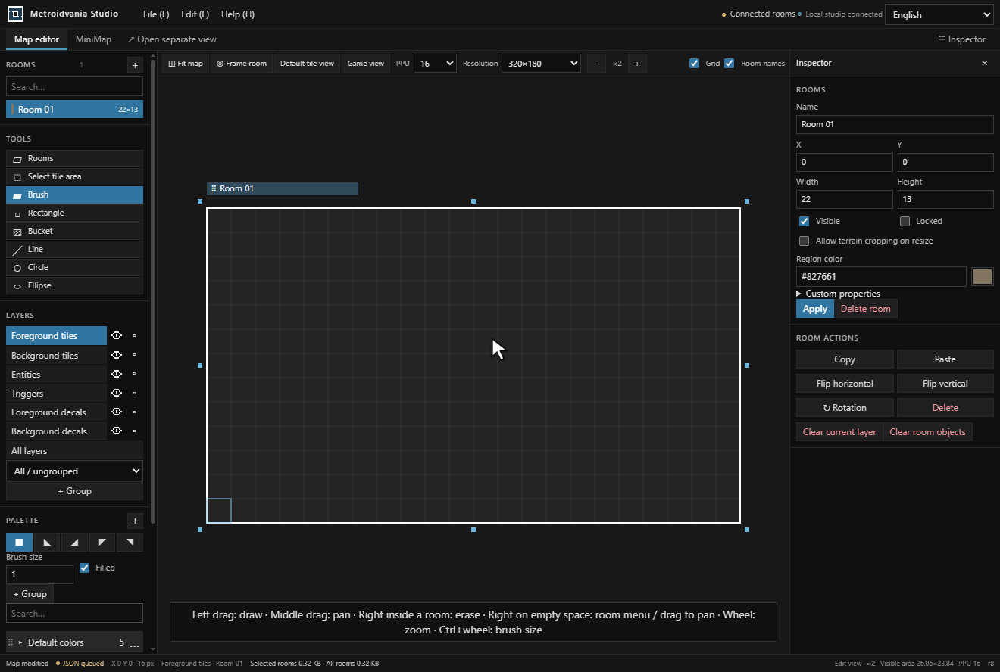
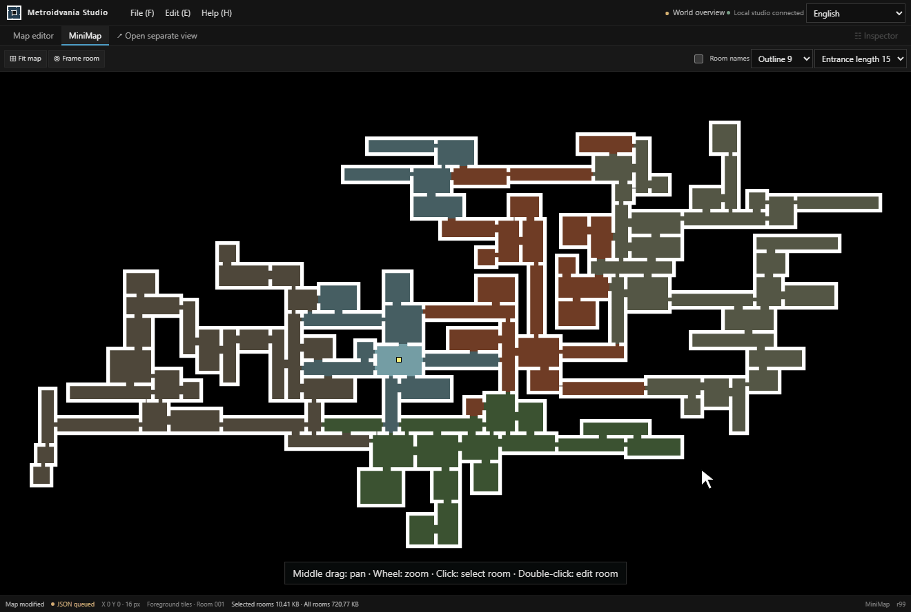

# Metroidvania Studio

Metroidvania Studio is a free, open-source 2D level editor for metroidvania games. Build connected rooms, paint autotiled maps, and design minimaps with JSON export for multiple game engines.

Runs locally on Windows, macOS, and Linux. No game engine installation is required to edit your maps.

[Download the studio](https://github.com/LBarimi/metroidvania-studio/releases/latest) · [Start with the sample world](sample-world.md) · [Browse the documentation](guides.md)

Automate map creation with [Lua scripts](scripting/quick-start.md), a [headless CLI](cli/quick-start.md), and a [local MCP server for AI agents](mcp/setup.md).

## Create connected rooms

Use the room-based map editor to paint terrain, connect passages, and adjust your layout. Move, resize, or rotate rooms as your world takes shape.

[Room layout guide](room-layout.md) · [4-tile and 47-tile autotiling](tilesets.md)

## Design your minimap

Give each area a color, adjust room outlines and entrances, and see how the world connects. Double-click a room in the minimap to return to editing it.

[Minimap guide](minimap.md) · [Check your framing with Game Preview](game-preview.md)

## Get started

1. Download the package for your platform from **GitHub Releases**, then extract it.
2. Open the launch file at the top level. The prebuilt web package requires **ASP.NET Core Runtime 10**.
3. Try the sample world. Select a room and left-drag to paint; middle-drag to pan and use the wheel to zoom.
4. Choose **File → Save map as** to save your work as JSON.

Prefer building from source? See the [build requirements and platform scripts](building.md).

## Use your maps in your engine

Export a shared JSON format and import it with an engine package. Maps and textures stay in your files; gameplay belongs in your game project.

| Engine | Package and installation |
| --- | --- |
| Unity | [Unity package](https://github.com/LBarimi/metroidvania-studio/tree/main/engine-packages/unity) |
| Godot | [Godot addon](https://github.com/LBarimi/metroidvania-studio/tree/main/engine-packages/godot) |
| Unreal Engine 4 / 5 | [UE4 plugin](https://github.com/LBarimi/metroidvania-studio/tree/main/engine-packages/ue4) · [UE5 plugin](https://github.com/LBarimi/metroidvania-studio/tree/main/engine-packages/ue5) |
| SDL3 | [C++ integration and sample](https://github.com/LBarimi/metroidvania-studio/tree/main/engine-packages/sdl) |

[Map JSON format](../metroidvania-studio/contracts/FORMAT.md) · [Texture files and engine resources](textures.md)

## Scripts, CLI, and AI agents

Run Lua in **File → Scripts**, work without opening the editor through the headless CLI, or let an AI agent edit maps through the local MCP server. These interfaces share validated editing operations, with dry runs and revision checks to review changes.

[Lua quick start](scripting/quick-start.md) · [Headless from a download](cli/release-downloads.md) · [MCP setup](mcp/setup.md) · [Editing API](api/index.md)

## Questions before you start

### Do I need a game engine to use the editor?

No. The studio runs independently. Install an engine package when you want to import a map into your game project.

### Where are my maps and textures saved?

In **Maps** and **Textures** beside the launcher or at the source project root. Use **File → Storage folders** to find them. Keep **Maps**, **Textures**, and **.studio** when updating the studio.

### Is it free to use?

Yes. Project-owned code and assets use the [MIT License](https://github.com/LBarimi/metroidvania-studio/blob/main/LICENSE). External components retain their [respective license notices](https://github.com/LBarimi/metroidvania-studio/blob/main/THIRD-PARTY-NOTICES.md).
