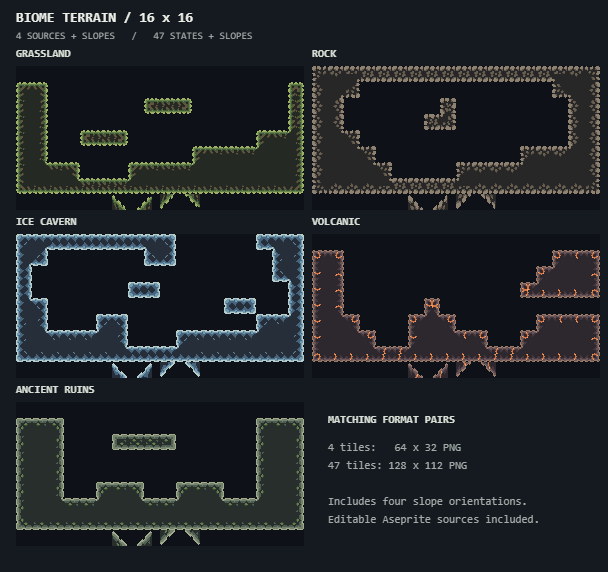

# Biome terrain tiles

16×16 pixel terrain with dark interiors, small clusters and limited shading. The default color templates remain separate.

| Theme | Files |
| --- | --- |
| Grassland | `grassland.png` |
| Rock | `rock.png` |
| Ice cavern | `ice-cavern.png` |
| Volcanic | `volcanic.png` |
| Ancient ruins | `ancient-ruins.png` |

Choose a sheet from `4-tiles/` or `47-tiles/`. Editable Aseprite originals are in `source/`.

## Use in the studio

The five themes are ready to paint in the **Default themes** palette group. To change the source sheet:

1. Open a theme’s **…** settings.
2. Choose **4 tiles** or **47 tiles** to match the sheet.
3. Import its PNG. Use **Assign in order** if the slots are not already filled.
4. Apply the palette. Both formats include four slope tiles.

In a running workspace these files are under `Textures/biomes/`. In the source repository they are under `samples/textures/biomes/`.

## Sheet layout

All coordinates use the top-left image origin. There is no spacing or padding between 16×16 cells.

- **4 tiles:** 64×32 PNG. First row: top surface, outer top-right corner, inner top-left corner, interior fill. Second row: bottom-left, bottom-right, top-left and top-right solid triangles.
- **47 tiles:** 128×112 PNG, eight columns. The first 47 cells follow the studio's normalized eight-neighbor masks in ascending order. The four triangles follow them; the remaining five cells are transparent.

The 47-tile sheets expand the matching four source tiles, so switching formats preserves their appearance. Four-source edges rotate around the terrain, including grass and surface details. Use nearest-neighbor sampling without smoothing or mipmaps.
